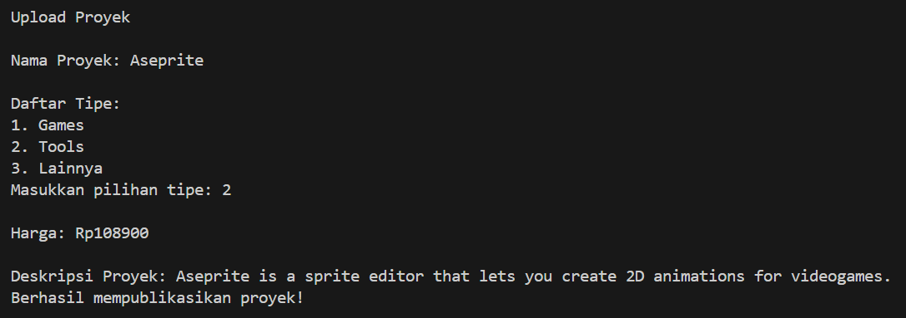
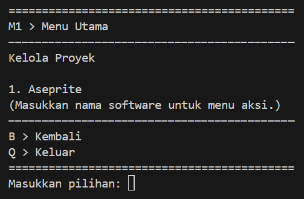
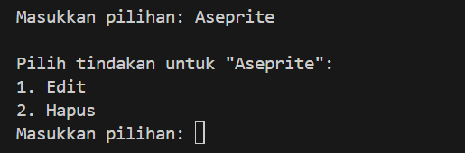
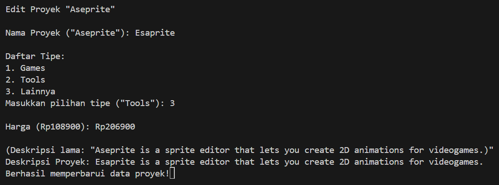
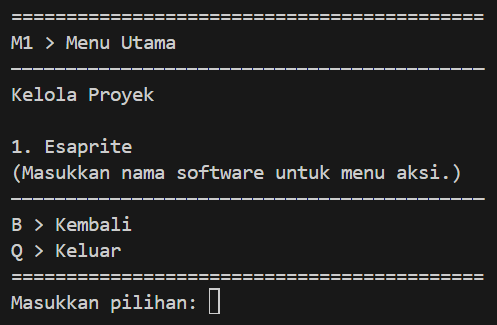
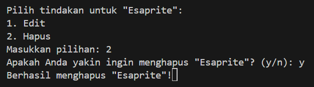

## Deskripsi Program

Program ini bertujuan untuk para software engineer untuk mempublikasikan karya softwarenya dengan gratis atau pun berbayar. Di dalam program ini terdapat CRUD berupa Upload Proyek hingga memanajemen proyek yang dapat diedit dan dihapus. 

## Fitur dan Tampilan Program
### Menu Utama

Di halaman ini, pengguna dapat memilih untuk melakukan upload atau mengelola proyek yang sudah pernah di-upload sebelumnya.

### Upload Software

Pada pilihan `Upload Software,` pengguna akan diarahkan ke dalam pertanyaan-pertanyaan mengenai data-data proyek yang akan dipublikasikannya. Jika pengguna berhasil melakukannya dengan benar, maka program akan memberikan informasi berhasil.

### Kelola Software

Dengan proyek software yang sudah pernah dipublikasikan oleh pengguna sebelumnya, pengguna dapat mengelolanya kembali untuk diedit atau dihapus dengan memasukkan nama proyeknya.

### Aksi Kelola

Memasukkan nama software akan mengarahkan pengguna kepada dua pilihan berupa `Edit` dan `Hapus.`

### Edit Proyek

Dalam pilihan `Edit,` pengguna akan diarahkan ke pertanyaan seperti pada saat melakukan `Upload Proyek.` Pengguna dapat mengganti data-data dalam proyeknya dan program juga akan menampilkan versi sebelumnya. 

Di bawah ini adalah tampilan kelola proyek setelah proyek software diedit.

### Hapus Proyek

Pada pilihan `Hapus` pada kelola proyek akan menghapus proyek yang sudah pernah dipublikasikan. Dalam proses penghapusan, pengguna diberikan pertanyaan konfirmasi bahwa benar-benar ingin menghapusnya. 

Di bawah ini adalah tampilan kelola proyek setelah proyek software dihapus.

