## Abstraction dan Interface
Penerapan interface di sini dilakukan pada class baru bernama IProyek, dengan dua method, yaitu `TampilkanDetail()` dan `InputAtributSpesial()`. Yang, mana setiap Proyek akan memiliki perilaku khusus pada setiap detail dan input atributnya.

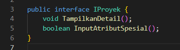

Di sini, method interface dari `TampilkanDetail()` menjadi method abstract di proyek, yang mana ketika TampilkanDetail dipanggil sekali, akan memiliki bentuk yang berbeda-beda. 

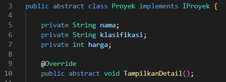
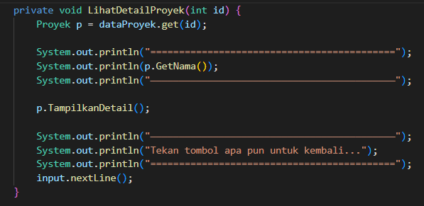

Di sini, method interface dari `InputAtributSpesial()` diimplementasikan pada setiap subclass, sehingga input atribut spesial dapat disesuaikan sesuai kebutuhan subclass. 

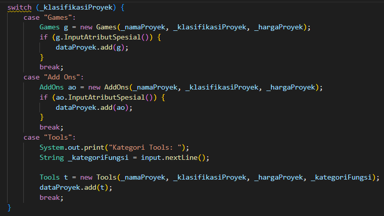
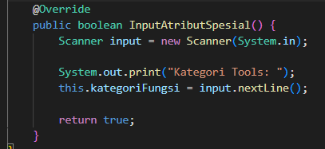

### Polymorphysm Statis (Overloading)

Penerapan overloading di sini digunakan untuk mengambil data genre untuk diload atau string yang menampilkan seluruh genre. 

Ketika method dipanggil tanpa argumen, maka method merupakan sebuah array string.

Sementara, ketika method dipanggil dengan satu argumen string, maka method menampilkan seluruh string yang terpisah berdasarkan argumen pertama.

## Deskripsi Program

Program ini bertujuan untuk para software engineer untuk mempublikasikan karya softwarenya dengan gratis atau pun berbayar. Di dalam program ini terdapat CRUD berupa Upload Proyek hingga memanajemen proyek yang dapat diedit dan dihapus. 

## Fitur dan Tampilan Program
### Menu Utama

Di halaman ini, pengguna dapat memilih untuk melakukan upload atau mengelola proyek yang sudah pernah di-upload sebelumnya.

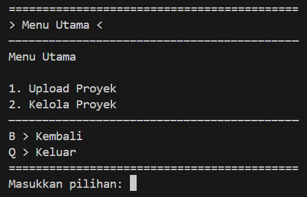

### Upload Proyek

Pada pilihan `Upload Proyek,` pengguna akan diarahkan ke dalam pertanyaan-pertanyaan mengenai data-data proyek yang akan dipublikasikannya. Jika pengguna berhasil melakukannya dengan benar, maka program akan memberikan informasi berhasil.

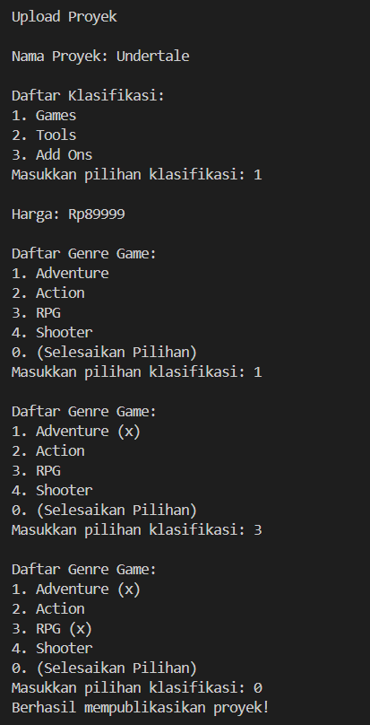

### Kelola Proyek

Dengan proyek software yang sudah pernah dipublikasikan oleh pengguna sebelumnya, pengguna dapat mengelolanya kembali untuk diedit atau dihapus dengan memasukkan nama proyeknya.

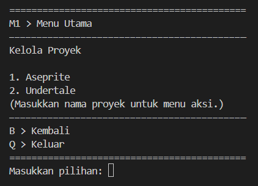

### Aksi Kelola

Memasukkan nama software akan mengarahkan pengguna kepada dua pilihan berupa `Edit` dan `Hapus.`

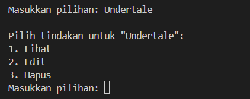

### Edit Proyek

Dalam pilihan `Lihat,` pengguna akan dapat melihat detail lengkap mengenai informasi proyek yang dipilihnya. 

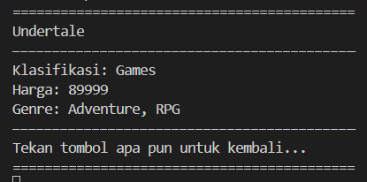

### Edit Proyek

Dalam pilihan `Edit,` pengguna akan diarahkan ke pertanyaan seperti pada saat melakukan `Upload Proyek.` Pengguna dapat mengganti data-data dalam proyeknya dan program juga akan menampilkan versi sebelumnya. 

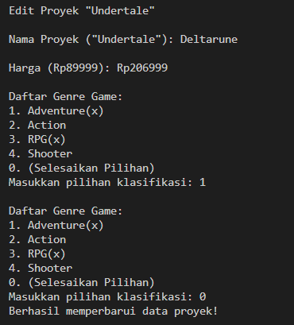

Di bawah ini adalah tampilan kelola proyek setelah proyek software diedit.

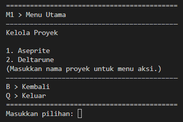

### Hapus Proyek

Pada pilihan `Hapus` pada kelola proyek akan menghapus proyek yang sudah pernah dipublikasikan. Dalam proses penghapusan, pengguna diberikan pertanyaan konfirmasi bahwa benar-benar ingin menghapusnya. 

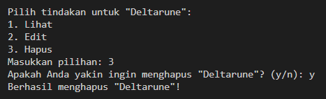

Di bawah ini adalah tampilan kelola proyek setelah proyek software dihapus.

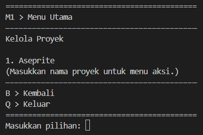